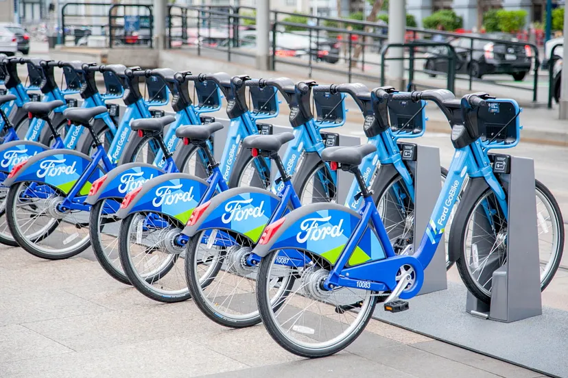

## Python Data Analysis Project: Bike Share Exploration
### Project Created on 8th October 2023.

## Introduction
Welcome to the bike share analysis project in the Udacity **Programming for Data Science with Python Nanodegree Track**. This project dives into the practical application of Python for data analysis.

## Overview
In this project, we embark on a data exploration journey through bike share systems in three major U.S. cities: `Chicago`, `New York City`, and `Washington`. Our goal is to provide an interactive terminal-based experience that allows users to answer intriguing questions by employing descriptive statistics.

## Files used in this project
Contained within this repository are three CSV files, each representing a cleaned dataset for the respective cities:

* _Chicago.csv_

* _New York City.csv_

* _Washington.csv_

These files are notably large, and to streamline repository management, they have been deliberately excluded from version control using the .gitignore configuration. 

Additionally, you will find a `bikeshare.py` file, which houses the script responsible for running the program.

## How to use
To get started, simply execute the script in your terminal using the command python `bikeshare.py`, and follow the on-screen instructions.

#### Find me in social media @ Densel Esekon

 
# All rights reserved &copy; Densel Esekon